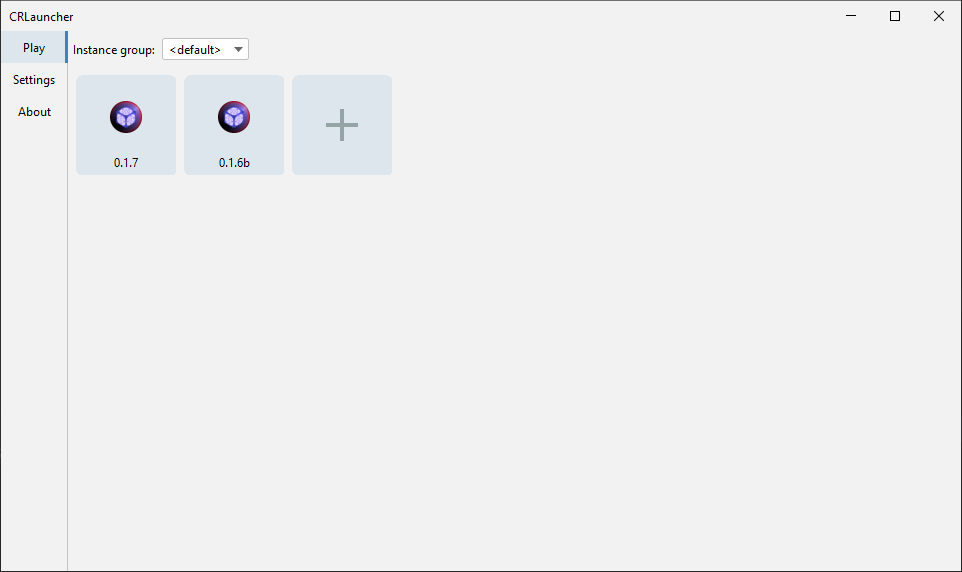

# CRLauncher

> [!WARNING]  
> This project is unfinished. Do not have any expectations.

CRLauncher - an unofficial launcher for [Cosmic Reach](https://finalforeach.itch.io/cosmic-reach)



### Quick Start

You can either download a prebuilt jar from [Releases](https://github.com/CRLauncher/CRLauncher/releases) page, or build it yourself. To do that you will need at least JDK 17:
```shell
$ git clone https://github.com/CRLauncher/CRLauncher
$ cd CRLauncher
$ gradlew build
# Or 
$ gradlew clean build
```

Done! To run the launcher, just do:
```shell
$ java -jar dist/CRLauncher-0.2.3.jar
```

If you want to change the location of launcher's files, add `--workDir` argument:
```shell
$ java -jar dist/CRLauncher-0.2.3.jar --workDir C:\Users\User\Documents\CRLauncher
```

Or you can use the `--useJarLocation` argument, which will make the launcher use the jar's location instead. In that case the `--workDir` argument will be ignored:
```shell
$ java -jar dist/CRLauncher-0.2.3.jar --useJarLocation
```
This way the launcher will create its files in build/libs


### Plans:
 - Add support for CRM-1 mod repositories