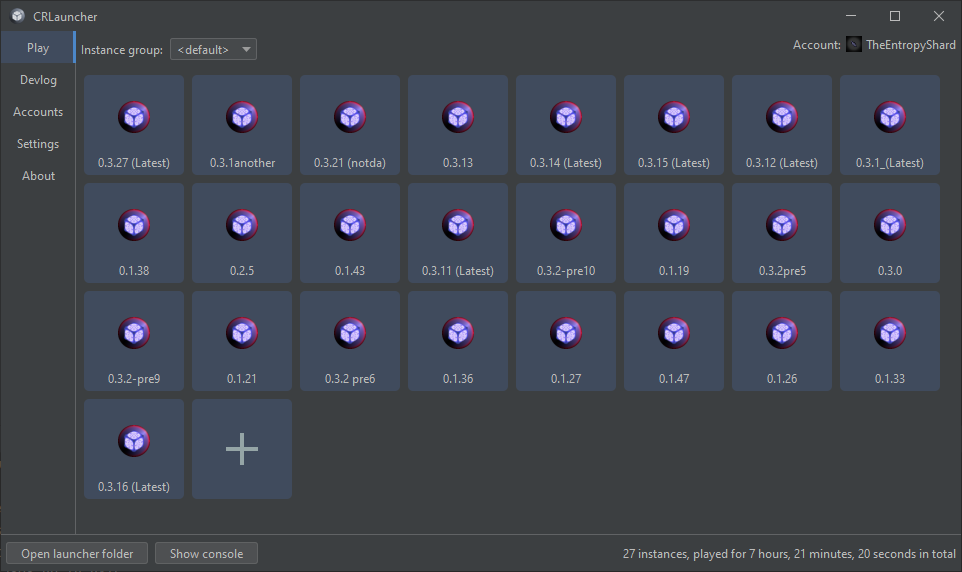

# CRLauncher

> [!WARNING]  
> This project is unfinished. Do not have any expectations.

CRLauncher - an unofficial launcher for [Cosmic Reach](https://finalforeach.itch.io/cosmic-reach)



### Quick Start

You can either download a prebuilt jar from [Releases](https://github.com/CRLauncher/CRLauncher/releases) page, or, build it yourself. To build CRLauncher you need at least JDK 17 and
[Apache Maven](https://maven.apache.org/):
```shell
git clone https://github.com/CRLauncher/CRLauncher
cd CRLauncher
mvn clean package
```

Done! To run the launcher, just do:
```shell
java -jar target/CRLauncher-0.0.5.jar
```

If you want to change the location of launcher's files, add `--workDir` argument:
```shell
java -jar target/CRLauncher-0.0.5.jar --workDir C:\Users\User\Documents\CRLauncher
```


### Plans:
 - Add a way to automatically install fabric